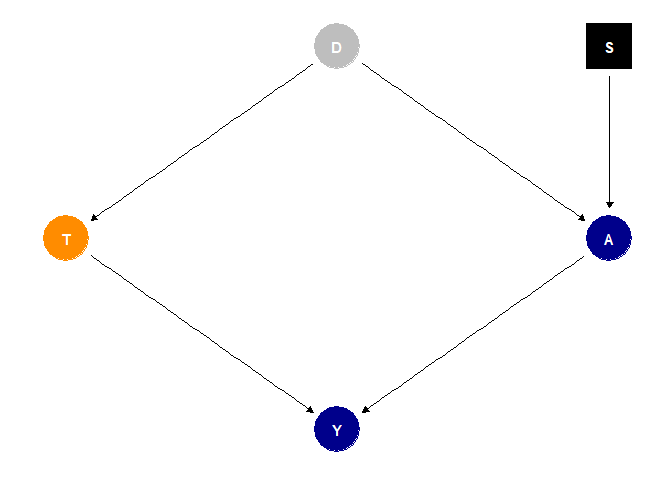
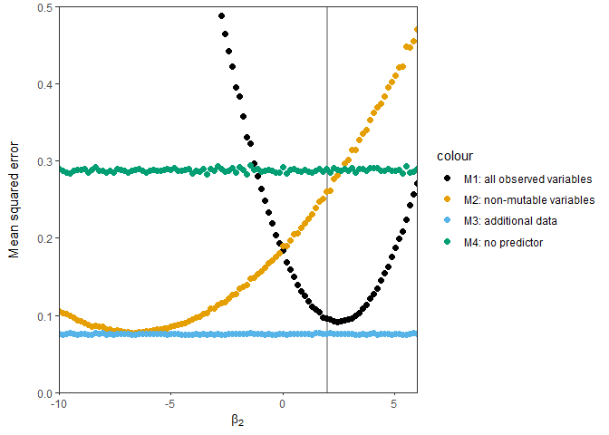

Machine learning for prediction of likely patient outcomes has been a hot topic for several years now. The increasing collection of routine medical data have enabled the modelling of a wide range of different outcomes across varies medical specialties. This interest in data-driven diagnosis and prognosis has only further burgeoned with the arrival of the SARS-CoV-2 pandemic. Countless research groups across countries and institutions have published models that use routine data to predict everything from [COVID-19 related deaths](https://bmcmedicine.biomedcentral.com/articles/10.1186/s12916-020-01893-3), escalation of care such as [admission to intensive care units or initiation of invasive ventilation](https://www.nature.com/articles/s41598-021-83784-y), or simply the [presence or absence of the virus](https://erj.ersjournals.com/content/56/2/2000775.short).

Unfortunately, if there is one thing my PhD's taught me repeatedly it's that deriving reliable models from routine medical data is challenging (as this [systematic review of 232 COVID-19 prediction models](https://www.bmj.com/content/369/bmj.m1328) can attest). There are many reasons why a given prediction model may not be reliable but the one I focus on in my own research --- and which we will therefore discuss in more detail in this blog post --- is model stability across environments. Here, environments can mean many different things but in the case of clinical prediction models, the environments of interest are often different healthcare providers (e.g., hospitals), with each provider representing a single environment in which we may want to use our model. Ideally, we would like our model to work well across many healthcare providers. If that's the case, we can use a single model across all providers. The model may therefore be considered "stable", "generalisable", or "transferable". If our models perform instead work well at only some providers but not at others, we may need to (re-)train them for each provider at which we want to use them. This not only causes additional overhead but also increases the risk of overfitting to any single provider and raises questions about the validation of each local model. Stability is therefore a desirable property of predictive models. In the remainder of this post, we will discuss the necessary conditions for stability and how we can identify likely instability in our prediction models. 

# Who this post is for

Here's what I assume you to know:

* You're familiar with [R](https://www.r-project.org/) and the [tidyverse](https://www.tidyverse.org/).
* You know a little bit about fitting and evaluating linear regression models . 
* You have a working knowledge of causal inference and Directed Acyclical Graphs (DAG). We will use DAGs to represent assumptions about our data and graphically reason about (in)stability through the backdoor criterion. If these concepts are new to you, first have a look [here](https://www.hsph.harvard.edu/miguel-hernan/causal-inference-book/) and [here](https://www.andrewheiss.com/research/chapters/heiss-causal-inference-2021/10-causal-inference.pdf).


```r
library(tidyverse)
library(ggdag)
library(ggthemes)
```

$$
\sum_{i=1}^N
$$

And some inline equation $\frac{1}{2}$ here and again for mathjax \[ \frac{1}{2}\].

# Model stability

In the introduction, I considered models stable if they worked comparable across multiple environments. While intuitive, this definition is of course very vague. Let's spend a little more time on defining what exactly (in mathematical terms) we mean by stability. The definitions here closely follows that of [Subbaswamy and Saria (2019)](https://arxiv.org/abs/1812.04597), which recently introduced a (in my opinion) very neat framework to think and reason about model stability using DAGs. 

Take for example the relatively simple DAG introduced in [Subbaswamy and Saria (2018)](https://arxiv.org/abs/1808.03253) and displayed in Figure <a href="#fig:example-dag">2.1</a>. Let's say we want to predict `T`, which may represent a clinical outcome of interest such as the onset of sepsis. In our dataset, we observe two variables `Y` and `A` that we could use to predict `T`. The arrows between `T`, `Y`, and `A` denote causal relationships between these variables, i.e., both `T` and `A` causally affect the value of `Y`. The absence of an arrow between `T` and `A` means that these variables do not directly affect each other. However, there is a final variable `D` that affects both the value of `T` and the value of `A`. We display `D` in grey because it is not observed in our dataset (e.g., because it is not routinely recorded by the clinician). If you had courses in statistics or epidemiology, you will know `D` as a confounding variable. 


```r
coords <- list(x = c(T = -1, A = 1, D = 0, Y = 0, S = 1),
                y = c(T = 0, A = 0, D = 1, Y = -1, S = 1))

dag <- dagify(
  T ~ D,
  A ~ D + S,
  Y ~ T + A,
  coords = coords
)

ggplot(dag, aes(x, y, xend = xend, yend = yend)) + 
  geom_dag_edges() + 
  # prediction target:
  geom_dag_point(data = ~ filter(., name == "T"), colour = "darkorange") +     
  # observed variables:
  geom_dag_point(data = ~ filter(., name %in% c("Y", "A")), colour = "darkblue") + 
  # unobserved variables:
  geom_dag_point(data = ~ filter(., name == "D"), colour = "grey") + 
  # selection variable indicating a distribution that changes across environments:
  geom_dag_point(data = ~ filter(., name == "S"), shape = 15) + 
  geom_dag_text() + 
  theme_dag()
```

<div class="figure" style="text-align: center">

<p class="caption">Figure 2.1: Directed acyclical graph specifying the causal relationships between a prediction target T, observed predictors A and Y, and an unobserved confounder D. The square node S represents a auxiliary selection variable that indicates variables that are mutable, i.e., change across different environments.</p>
</div>

So far this is a pretty standard DAG. However, there is an odd square node in this graph that we haven't mentioned yet: the selection variable `S`. [Subbaswamy and Saria (2019)](https://arxiv.org/abs/1812.04597) suggest to use the auxiliary variable `S` to point to any variables in our graph that may vary arbitrarily across environments. Variables referenced by `S` are also called *mutable* variables. By including an arrow from `S` to `A` in Figure <a href="#fig:example-dag">2.1</a>, we therefore claim that `A` is mutable and cannot be relied on in any environment that isn't the training environment. Note that we do not make any claim as to why this variable is mutable, we merely state that its distribution may be shift across environments.    

Once we have defined a DAG and all its mutable variables, we can graphically check whether our predictor is unstable by looking for any active unstable paths. [Subbaswamy and Saria (2019)](https://arxiv.org/abs/1812.04597) show that *the non-existence of active unstable paths is a graphical criterion for determining [...] stability*. Easy, right? At least once we know what they mean by an active unstable path. Let's look at it term for term:

* *path*: a path is simply a sequence of nodes in which each consecutive pair of nodes is connected by an edge. Note that the direction of the edge (i.e., which way the arrow points) does not matter here. There are many different paths in Figure <a href="#fig:example-dag">2.1</a> such as `D -> T -> Y` or `T <- D -> A <- S`.
* *active*: whether a path is active or closed can be determined using the standard rules of d-separation to determine stability (see chapter 6 of [Hernán and Robins (2020)](https://www.hsph.harvard.edu/miguel-hernan/causal-inference-book/) for a refresher on d-separation). Roughly speaking, a path is active if it either a) contains a variable that is conditioned on by including it in the model or b) contains a collider that it is **not** conditioned on. For example, `T <- D -> A <- S` is closed due to the collider `-> A <-` but becomes active if `A` is included in the model. It can be closed again by also including `D` in the model (if it were observed).
* *unstable*: a path is unstable if it includes a selection variable `S`.

If you have worked with DAGs before, you probably already knew about active paths. The only new thing you need to learn is to only look for those active paths that are unstable, which is easy enough to verify. You don't even need to look at all paths, only at those that include `S`! So let's do it for our example in Figure <a href="#fig:example-dag">2.1</a>. 


# Applying the theory to a toy example

Given the DAG in Figure <a href="#fig:example-dag">2.1</a>, we could use different sets of variables to predict our target variable `T`. For example, we could a) decide to use the observed variables `A` and `Y`, b) use `Y` alone, c) explore the possibility to use all variables by collecting additional data on `D` or d)  use no predictors (i.e., always predict the average). Let's look at those options in turn and determine whether they would result in a stable model. 

## Use all observed variables as predictors

A common practice in prediction modelling is to include as many variables as possible (and available). In Figure <a href="#fig:example-dag">2.1</a>, this would mean that we'd use `A` and `Y` to estimate the conditional probability $P(T~|~A, Y)$. Would such an estimate be stable? Let's check for active unstable paths. There are two paths `T -> Y <- A <- S` and `T <- D -> A <- S` that include `S`. The first contains an open collider at `-> Y <-` (because it is included in the model) but it is blocked by also conditioning on `A`, making it closed. The second path also contains an open collider, namely at `-> A <-`. Since we do not observe `D`, this path is active and unstable.

## Use only non-mutable observed variables as predictors

In recent years, researchers have become mindful of the fact that some relationships may be unreliable. For example, it is not unusual to see [models that purposefully ignore information on medication to avoid spurious relationships](https://arxiv.org/abs/2107.05230). Following a similar line of argument, it could be tempting to remove `A` (which is mutable) from the model and only predict $P(T~|~Y)$. After all, if we are not relying on mutable variables we may be safe from instability. Unfortunately, this isn't an option either (at least not in this particular examples). If we remove `A` from the model, the previously blocked path `T -> Y <- A <- S` is now open and we are again left with an unstable model. 

## Collect additional data

By now, you might have thrown your hands up in despair. Neither option using the observed variables led to a stable model (note that adjusting only for `A` also does not solve the issue because there is still an open path via `D`). In our particular example, there is another possibility for a stable model if we have the time and resources to measure the previously unobserved variable `D`, but of course we only want to do so if it leads to a stable predictor. So is $P(T~|~A, Y, D)$ stable? It turns out it is, as both `T -> Y <- A <- S` (by `A`) and `T <- D -> A <- S` (by `D`) are blocked and our model will therefore be stable across environments.  

## Use no predictors 

What else can we do if we do not want or can't collect data on `D`. One final option is always to admit defeat and simply make a prediction based on the average $P(T)$. This estimate is stable but obviously isn't a very good predictor. Yet what else is there left to do? Thankfully not all is lost and there are other smart things we could do to obtain a stable predictor without the need for additional data collection. I will talk about some of these options in my next posts.

# Testing the theory

Up to now, we have used theory to determine whether a particular model would result in a stable predictor. In this final section, we simulate data for Figure <a href="#fig:example-dag">2.1</a> to test our conclusions and confirm the (lack of) stability of all models considered above. Following the example in [Subbaswamy and Saria (2018)](https://arxiv.org/abs/1808.03253), we use simple linear relationships and Gaussian noise for all variables, giving the following structural equations:

$$
\begin{aligned}
D &\sim N(0, \sigma^2) \\
T &\sim N(\beta_1D, \sigma^2) \\
A &\sim N(\beta_2^eD, \sigma^2) \\
Y &\sim N(\beta_3T + \beta_4A, \sigma^2)
\end{aligned}
$$

You might have noticed the superscript $e$ in $\beta^e_2$. We use this superscript to indicate that the coefficient depends on the environment $e \in \mathcal{E} \}$ where $\mathcal{E}$ is the set of all possible environments. Since the value of the coefficient depends on the environment, `A` is mutable (note that we could have chosen other ways to make `A` mutable, for example by including another unobserved variable that influences `A` and changes across environments). All other coefficients are constant across environments, i.e., $\beta_i^e = \beta_i$ for $i \in \{1, 3, 4 \}$. Finally, we set a uniform noise $\sigma^2=0.1$ for all variables. We combine this into a function that draws a sample of size $n$.


```r
simulate_data <- function(n, beta, dev = 0) {
  noise <- sqrt(0.1) # rnorm is parameterised as sigma instead of sigma^2
  
  D <- rnorm(n, sd = noise)
  T <- rnorm(n, beta[1] * D, sd = noise)
  A <- rnorm(n, (beta[2] + dev) * D, sd = noise)
  Y <- rnorm(n, beta[3] * T + beta[4] * A, sd = noise)
  
  tibble(D, T, A, Y)
}

set.seed(42)
n <- 30000

# Choose coefficients
beta <- vector("numeric", length = 4)
beta[2] <- 2                  # we manually set beta_2 and vary it by env
beta[c(1, 3, 4)] <- rnorm(3)  # we randomly draw values for the other betas

cat("Betas: ", beta)
```

```
## Betas:  1.370958 2 -0.5646982 0.3631284
```

We will define model performance in terms of the mean squared error (MSE) $n^{-1} \sum_{i=1}^n (t_i - \hat t_i)^2$, where $t_i$ is the true value of `T` for patient $i$ and $\hat t_i$ is the estimate given by our model. The function `fit_and_eval()` fits a linear regression model to the training data and returns its MSE on some test data. By varying $\beta^{e}_2$ in the test environment, we can test how our models perform when the coefficient deviates more and more from the value seen in our training environment. 


```r
mse <- function(y, y_hat){
  mean((y - y_hat) ^ 2)
}

fit_and_eval <- function(formula, train, test) {
  fit <- lm(formula, data = train)
  pred <- predict(fit, test)
  mse(test$T, pred)
}
```

Now that we've defined everything we need to run our simulation, let's see how our models fare. Since we are only running linear regressions that are easy to compute, we can set the number of samples to a high value (N=30,000) to get stable results. The performance of our four models across the range of $\beta_2$ can be seen in Figure <a href="#fig:run-simulations">4.1</a>. Our simulations appear to confirm our theoretical analysis. The full model `M3` (blue) retains a stable performance across all considered $\beta_2$'s. `M1` and `M2` on the other hand have U-shaped performance curves that depend on the value of $\beta_2$ in the test environment. When $\beta_2$ is close to the value in the training environment (vertical grey line), `M1` achieves a performance that is almost as good as that of the full model `M3`. However, as the coefficient deviates from its value in the training environment, model performance quickly deteriorates and even becomes worse than simply using the global average (`M4` green line). 


```r
# Training environment (always the same)
train <- simulate_data(n, beta)

# Test environments (beta_2 deviates from training env along a grid)
grid_len <- 100L
all_obs <- only_y <- add_d <- no_pred <- vector("numeric", grid_len)
devs <- seq(-12, 4, length.out = grid_len)

for (i in 1:grid_len) {
  # Draw test environment
  test <- simulate_data(n, beta, dev = devs[i])
  
  # Fit each model
  all_obs[i] <- fit_and_eval(T ~ Y + A    , train, test)
  only_y[i]  <- fit_and_eval(T ~ Y        , train, test)
  add_d[i]   <- fit_and_eval(T ~ Y + A + D, train, test)
  no_pred[i] <- fit_and_eval(T ~ 1        , train, test)
}

results <- tibble(devs, all_obs, only_y, add_d, no_pred)


ggplot(results, aes(x = beta[2] + devs)) + 
  geom_vline(xintercept = beta[2], colour = "darkgrey", size = 1) + 
  geom_point(aes(y = all_obs, colour = "M1: all observed variables"), size = 2) + 
  geom_point(aes(y = only_y, colour = "M2: non-mutable variables"), size = 2) + 
  geom_point(aes(y = add_d, colour = "M3: additional data"), size = 2) + 
  geom_point(aes(y = no_pred, colour = "M4: no predictor"), size = 2) + 
  scale_colour_colorblind() + 
  labs(
    x = expression(beta[2]),
    y = "Mean squared error\n"
  ) +
  coord_cartesian(ylim = c(0, 0.5), expand = FALSE) + 
  theme_bw() + 
  theme(
    panel.grid = element_blank()
  )
```

<div class="figure" style="text-align: center">

<p class="caption">Figure 4.1: Mean squared error of all models across a range of test environments that differ in the coefficient for the relationship D -> A. The vertical grey line indicates the training environment.</p>
</div>

I have to admit I was surprised by the results for `M2`, which I expected to be similar to but slightly worse than `M1`. Instead of a minimum close to the training environment, however, `M2` achieved its best performance far away at $\beta_2 \approx -7.5$ whereas the performance in the training environment was barely better than using no predictors. Its $R^2$ was only 0.093 compared to 0.672 for `M1` and 0.741 for `M3`. The reason for this seems to be a very low variance of `Y` given the particular set of $\beta$'s chosen. As the value of $\beta_2$ decreases the variance of `Y` and its covariance with `D` and `T` changes such that it becomes a better predictor of `T` (and even crowds out the "direct" effect of `D` due to the active backdoor path `D -> A -> Y <- T`).

Finally, note that the scale of the curves in Figure <a href="#fig:run-simulations">4.1</a> depends on the values chosen for $\beta_1$, $\beta_2$, and $\beta_4$. The shape of the curves and the overall conclusions remain the same, though.


# Note on patient mix

So far I've acted as if incorrectly estimated model coefficients are the only reason for changes in performance across environments. However, if you've ever performed (or read about) external validation of clinical prediction models, you may by now be shouting at your screen that there are other reasons for performance changes. In fact, even if our model is specified perfectly (i.e., all coefficients are estimated with their true causal values) it may not always be possible to achieve the same performance across environments. I discussed in a [previous post](https://www.patrick-rockenschaub.com/posts/2021/11/contextual-nature-of-auc/) how the AUC may change depending on the make-up of your target population even if we know the exact model that generated the data. The same general principle is true for MSE. Some patients may simply be harder to predict than others and if your population contains more of one type of patients than the other, average performance of your model may change (though model performance remains the same for each individual patient assuming your coefficients are correct!). The make-up of your population is often referred to as patient mix. In our case, patient mix remained stable across environments (we did not change `D -> T`). I chose this setup to focus on the effects of a mutable variables when estimating model parameters. However, thinking hard about your patient mix becomes indispensable when transferring our model to new populations. If you want to read up further on this topic, I can recommend chapter 19 of [Ewout Steyerberg's book on Clinical Prediction Models](https://link.springer.com/book/10.1007/978-0-387-77244-8) which includes some general advice on how to distinguish changes in patient mix from issues of model misspecification. 


# Acknowledgements

The structure of this post (and likely all future posts) was inspired by the great posts on [Andrew Heiss' blog](https://www.andrewheiss.com/) and in particular his posts on [inverse probability weighting in Bayesian models](https://www.andrewheiss.com/blog/2021/12/18/bayesian-propensity-scores-weights/) and the [derivation of the trhee rules of do-calculus](https://www.andrewheiss.com/blog/2021/09/07/do-calculus-backdoors/). Andrew is an assistant professor in the Department of Public Management and Policy at Georgia State University, teaching on causal inference, statistics, and data science. His posts on these topics have been a joy to read and I am striving to make mine as effortlessly educational.

